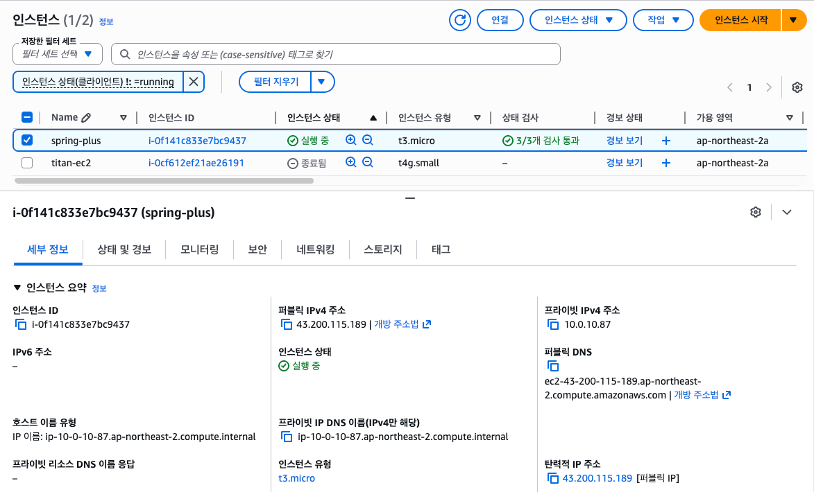
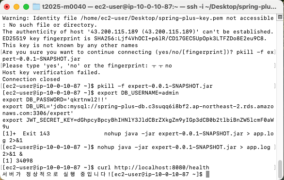
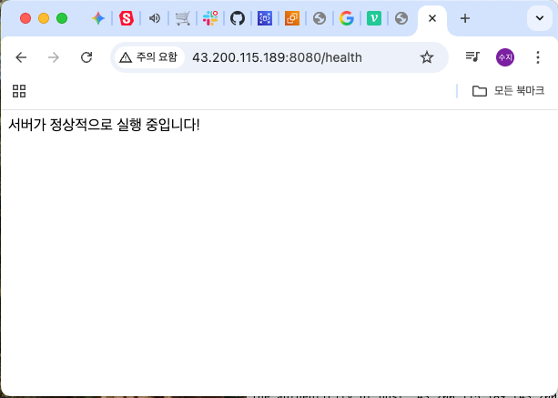
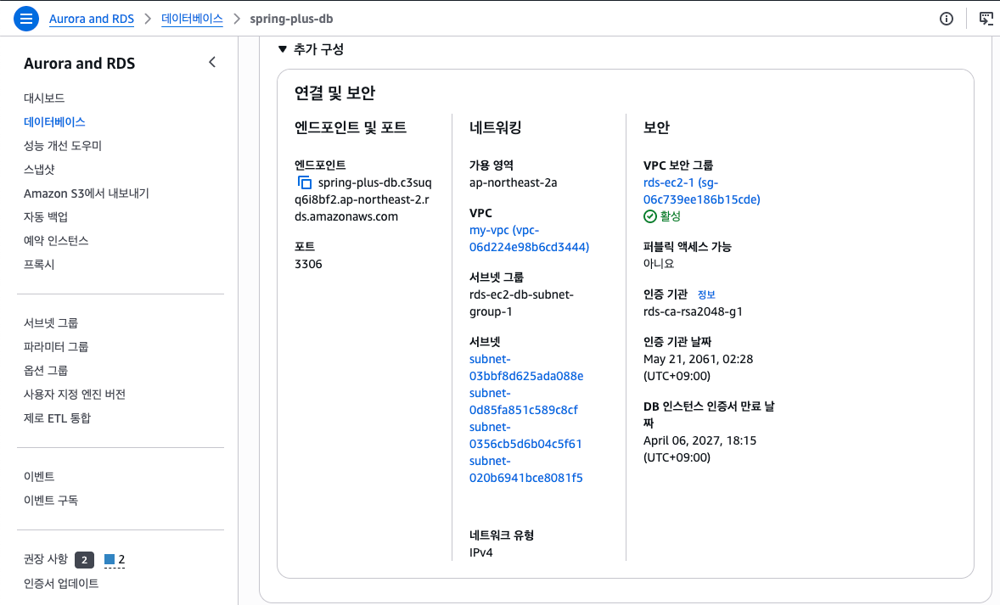
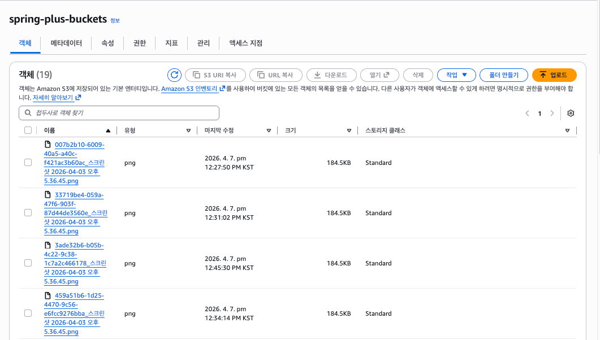
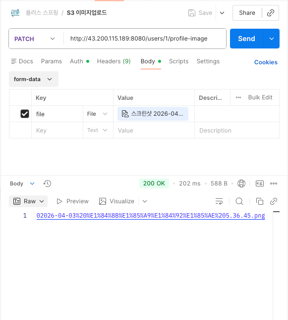
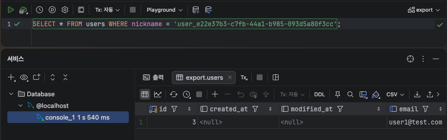
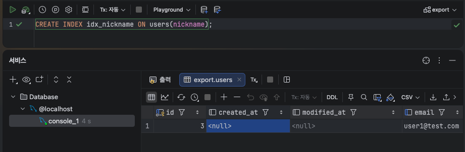
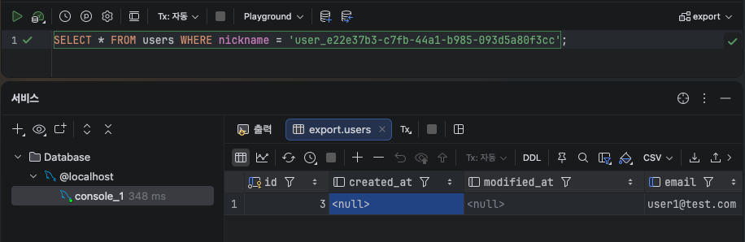

# 🌱 Spring Plus

<div align="center">


** Plus Spring 개별 과제**

👩‍💻 **박수지**

</div>

---

## ☁️ AWS 배포

### 12-1. EC2

- 인스턴스 유형: t3.micro (프리티어)
- 운영체제: Amazon Linux 2023
- 탄력적 IP: `43.200.115.189`
- Java 17 (Amazon Corretto) 설치

#### 헬스체크 APIGET http://43.200.115.189:8080/health
→ 응답: "서버가 정상적으로 실행 중입니다!"

#### 📸 EC2 설정 화면


#### 📸 헬스체크 API 동작 화면



---

### 12-2. RDS

- 엔진: MySQL 8.0
- 인스턴스: db.t3.micro (프리티어)
- 엔드포인트: `spring-plus-db.c3suqq6i8bf2.ap-northeast-2.rds.amazonaws.com`

#### 📸 RDS 설정 화면



---

### 12-3. S3

- 버킷명: `spring-plus-buckets`
- 리전: ap-northeast-2 (서울)
- 유저 프로필 이미지 업로드 API 구현

#### 프로필 이미지 업로드 API PATCH /users/{userId}/profile-image
Authorization: Bearer {JWT토큰}
Body: form-data (file)

#### 📸 S3 버킷 화면


#### 📸 이미지 업로드 성공 화면


---

## 📊 대용량 데이터 처리 - 성능 개선 결과

### 테스트 환경
- 데이터 수: 5,000,000건
- 검색 조건: 닉네임 정확히 일치 검색
- DB: MySQL

### Bulk Insert 결과
- 총 소요 시간: **7분 56초**
- 방법: JDBC Bulk Insert (배치 사이즈: 1,000)

---

### 📈 조회 속도 비교

| 단계 | 방법 | 실행 시간 | 개선율 |
|------|------|----------|--------|
| 1단계 | 인덱스 없음 (기본) | 1,540ms | - |
| 2단계 | nickname 인덱스 추가 | 348ms | 약 4.4배 향상 ⬆️ |

### 📊 조회 속도 비교 그래프
````mermaid
xychart-beta
    title "닉네임 검색 속도 비교 (ms)"
    x-axis ["인덱스 없음", "인덱스 적용 후"]
    y-axis "실행 시간 (ms)" 0 --> 1700
    bar [1540, 348]
````
---

### 🔍 인덱스 적용 방법
```sql
-- 인덱스 추가
CREATE INDEX idx_nickname ON users(nickname);
```

### 💡 성능 개선 이유

**인덱스 없을 때**
- 500만건 전체를 하나씩 확인 (Full Table Scan)
- 실행 시간: 1,540ms

**인덱스 있을 때**
- B-Tree 인덱스로 바로 위치를 찾아감 (Index Scan)
- 실행 시간: 348ms
- 닉네임 **정확히 일치** 검색이라 인덱스 효과가 극대화됨!

---

### 📸 실행 결과

**1단계 - 인덱스 없을 때**



**2단계 - 인덱스 추가**



**3단계 - 인덱스 적용 후**



---
## 💭 과제를 마치며

### 🤔 Bulk Insert, 실제로 언제 쓸까?

이번 과제에서 JDBC Bulk Insert로 500만건을 삽입하면서
한 가지 의문이 생겼다.

> **"현업에서 실제로 한번에 대량 삽입할 일이 있을까?"**
> 유저들은 제각각 가입하는데...

고민해보니 아래와 같은 경우에 실제로 쓰인다는 것을 알았다.

| 상황 | 설명 |
|------|------|
| 데이터 마이그레이션 | 기존 DB에서 새 DB로 대량 이전 |
| 초기 데이터 세팅 | 서비스 오픈 전 기초 데이터 대량 입력 |
| 배치 작업 | 매일 밤 대량의 로그, 통계 데이터 저장 |
| 외부 데이터 연동 | 엑셀, CSV 파일로 대량 데이터 업로드 |
| 테스트 데이터 생성 | 성능 테스트용 대량 데이터 생성 |

단순히 **"코드를 짜는 것"** 에서 멈추지 않고
**"왜 이 기술이 필요한가?"** 를 함께 고민하는 것이
더 나은 개발자가 되는 길이라고 느꼈다. 💪

---

### 🚀 추후 개선 예정

이번 과제에서 시간 관계상 구현하지 못했지만
꼭 해보고 싶은 것이 있다.

#### Redis 캐싱 적용

500만건 데이터에서 닉네임 검색 시
인덱스를 적용해 **348ms**까지 줄였지만
**Redis 캐싱**을 적용하면 더 개선할 수 있을 것 같다.

| 단계 | 방법 | 예상 속도 |
|------|------|----------|
| 1단계 | 인덱스 없음 | 1,540ms |
| 2단계 | 인덱스 적용 | 348ms |
| 3단계 | Redis 캐싱 적용 | 1ms 이하 (예상) |

> 자주 검색되는 닉네임은 Redis 메모리에 캐싱해두면
> DB 조회 없이 바로 응답할 수 있어
> 훨씬 빠른 응답이 가능할 것으로 예상된다.
> 추후 꼭 직접 구현해볼 예정이다! 💪